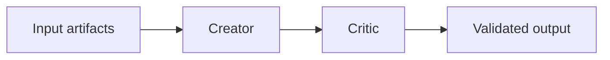

# Execution Trace

Execution traces are compact handoff records for multi-step workflows.

They are useful when a workflow uses multiple agents, loops through validation, or needs to be resumed later.

## Suggested Location

```text
quality_reports/execution_traces/
```

## Minimum Fields

- workflow skill and mode
- user goal
- resolved paths
- agents dispatched
- inputs checked
- outputs produced
- critic or verifier results
- decisions made
- blockers
- next step

## Mermaid Trace

When useful, include a short Mermaid graph:



## Relationship To Checkpoints

Use `.codex-state/` checkpoints for session continuity.
Use execution traces for workflow-level auditability.
